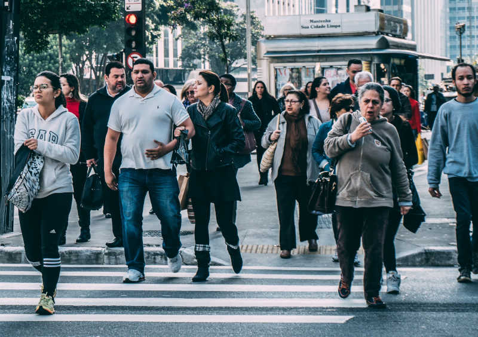

# Blurring faces in images using deface
This is a simple code for blurring all imgs in a given a directory using [deface](https://github.com/ORB-HD/deface) library.

Original frame | `deface` output (using default options including 0.2 threshold) | `deface` output (using 0.7 threshold options)
:--:|:--:|:--:
 |  | 


The following description from the deface lib. You can esily extend the current code to include whatever combination you would like.

```
usage: deface [--output O] [--thresh T] [--scale WxH] [--preview] [--boxes]
              [--draw-scores] [--mask-scale M]
              [--replacewith {blur,solid,none,img}] [--replaceimg REPLACEIMG]
              [--ffmpeg-config FFMPEG_CONFIG] [--backend {auto,onnxrt,opencv}]
              [--version] [--help]
              [input ...]

Video anonymization by face detection

optional arguments:
  --output O, -o O      Output file name. Defaults to input path + postfix
                        "_anonymized".
  --thresh T, -t T      Detection threshold (tune this to trade off between
                        false positive and false negative rate). Default: 0.2.
  --scale WxH, -s WxH   Downscale images for network inference to this size
                        (format: WxH, example: --scale 640x360).
  --preview, -p         Enable live preview GUI (can decrease performance).
  --boxes               Use boxes instead of ellipse masks.
  --draw-scores         Draw detection scores onto outputs.
  --mask-scale M        Scale factor for face masks, to make sure that masks
                        cover the complete face. Default: 1.3.
  --replacewith {blur,solid,none,img}
                        Anonymization filter mode for face regions. "blur"
                        applies a strong gaussian blurring, "solid" draws a
                        solid black box, "none" does leaves the input
                        unchanged and "img" replaces the face with a custom
                        image. Default: "blur".
  --replaceimg REPLACEIMG
                        Anonymization image for face regions. Requires
                        --replacewith img option.
  --ffmpeg-config FFMPEG_CONFIG
                        FFMPEG config arguments for encoding output videos.
                        This argument is expected in JSON notation. For a list
                        of possible options, refer to the ffmpeg-imageio docs.
                        Default: '{"codec": "libx264"}'.
  --backend {auto,onnxrt,opencv}
                        Backend for ONNX model execution. Default: "auto"
                        (prefer onnxrt if available).
  --version             Print version number and exit.
  --help, -h            Show this help message and exit.
```

